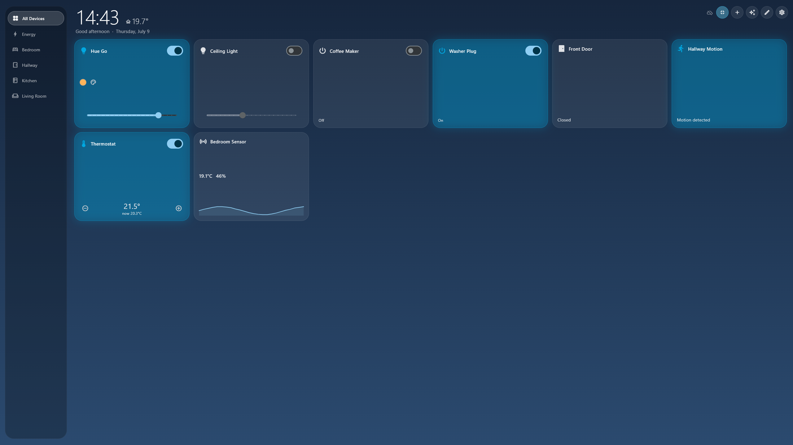

<div align="center">

# 🏠 Home Nexus

### One app for every smart device, on every protocol — hub or no hub.

[](https://github.com/mamoonk/omni-assistant/actions/workflows/ci.yml)


[](LICENSE)



*The ambient dashboard in kiosk mode — an Echo Show/Hub-style centerpiece for a wall-mounted display.*

</div>

---

## ✨ What is this?

**Home Nexus** discovers, configures, and controls smart devices whether you
already run a hub or are starting from zero:

- 🔌 **Have Home Assistant?** Connect it and every entity appears instantly.
- 📡 **Run Zigbee2MQTT?** Point the app at your broker — no hub needed.
- 🆕 **Starting fresh?** Run the **Nexus Bridge** (one Go binary) and
  commission Zigbee & Matter devices from your phone with a guided wizard.
- 🌐 **Odd device?** Wrap any HTTP endpoint as a generic switch, light, or
  sensor.

Everything lands in one **unified device model**, so scenes, automations, and
voice commands compose across sources — a Zigbee motion sensor can switch a
Wi-Fi relay and a Home Assistant light in a single rule.

---

## 🎛️ Feature tour

| | Feature | Details |
|---|---|---|
| 🖼️ | **Ambient dashboard** | Time-of-day gradient, oversized live clock, indoor temperature, frosted-glass tiles that glow when active. Side rail on wide screens, pill nav on phones. |
| 🖥️ | **Kiosk mode** | One tap: fullscreen + wake-lock. After 3 idle minutes, a drifting ambient clock (burn-in safe). Tap to wake. |
| 🗣️ | **Voice & commands** | *"turn on the kitchen light"*, *"dim hue go to 30"*, *"set thermostat to 21.5"*, *"run scene evening"*, *"turn off everything"*. Speak (Android/iOS/macOS/Windows) or type — same intent engine. |
| 🎬 | **Scenes** | Snapshot the current state of any devices; activate from routine pills with parallel command fan-out. |
| ⚙️ | **Automations** | Device-state triggers (edge-fired), time triggers, **sunrise/sunset ± offset** (built-in solar calculator). Time-window conditions with overnight wrap. Actions: set state or run scene. |
| ♾️ | **24/7 rules** | Automations whose devices all live on the Nexus Bridge sync to it and run **without the phone** — surviving bridge restarts. The app engine covers cross-source rules. |
| ⚡ | **Energy view** | Live total draw + per-device W/kWh from any power-metering source. |
| ✏️ | **Dashboard editor** | Drag to reorder, resize tiles, custom tabs, per-room tabs auto-generated. |
| 📴 | **Offline-first** | Device cache renders instantly on cold start; stale badges while a source reconnects (exponential backoff). |
| 🔐 | **Secured** | Credentials in the OS keychain (DPAPI/Keystore/Keychain). Bridge requires a pairing token; mDNS tells the app up front whether one is needed. |

---

## 🧱 Architecture

```
┌──────────────────────── Flutter app ────────────────────────┐
│  Ambient dashboard · Scenes · Automations · Voice · Wizard  │
│                                                              │
│            UniversalDevice + Capability model                │
│      (one Rosetta Stone — every adapter maps into it)        │
│   ┌──────────┐ ┌──────────┐ ┌───────────┐ ┌─────────────┐    │
│   │   Home   │ │   MQTT   │ │   Nexus   │ │  Manual IP  │    │
│   │Assistant │ │(Zigbee2- │ │  Bridge   │ │(HTTP switch/│    │
│   │(WebSocket│ │  MQTT)   │ │(WebSocket │ │light/sensor)│    │
│   │ adapter) │ │ adapter  │ │ adapter)  │ │  adapter    │    │
│   └────┬─────┘ └────┬─────┘ └─────┬─────┘ └─────────────┘    │
└────────┼────────────┼─────────────┼──────────────────────────┘
         ▼            ▼             ▼
   Home Assistant  MQTT broker   Nexus Bridge (Go, single binary)
                                 ├─ embedded MQTT broker (no Mosquitto!)
                                 ├─ Zigbee2MQTT manager (supervised child)
                                 ├─ Matter commissioning (QR parser + chip-tool)
                                 ├─ automation runtime (24/7 rules)
                                 ├─ BoltDB persistence · pairing-token auth
                                 └─ mDNS: _nexus-bridge._tcp
```

| Component | Path | Stack |
|---|---|---|
| App | [`home_nexus/`](home_nexus) | Flutter + Riverpod |
| Core model | [`packages/unification`](home_nexus/packages/unification) | pure Dart, zero deps |
| HA adapter | [`packages/home_assistant_adapter`](home_nexus/packages/home_assistant_adapter) | WebSocket |
| MQTT adapter | [`packages/mqtt_adapter`](home_nexus/packages/mqtt_adapter) | mqtt_client |
| Bridge adapter | [`packages/nexus_bridge_adapter`](home_nexus/packages/nexus_bridge_adapter) | WebSocket + mDNS |
| Nexus Bridge | [`bridge/`](bridge) | Go · mochi-mqtt · BoltDB |

---

## 🚀 Quick start

```sh
# 1 — the app
cd home_nexus && flutter run

# 2 — the bridge (no hardware? demo mode simulates Zigbee + Matter radios)
cd bridge && go run . -demo
# note the pairing token printed in the log

# 3 — in the app
#    Settings → Nexus Bridge → Search network → enter token → Connect
#    then hit ＋ to run the inclusion wizard 🎉
```

Real radios: see [`bridge/README.md`](bridge/README.md) for Zigbee2MQTT
wiring (the bridge embeds its own MQTT broker) and Matter via chip-tool.
Thread devices additionally need an
[OpenThread Border Router](https://openthread.io/guides/border-router) on the
LAN.

## 🧪 Tests

```sh
cd home_nexus && flutter test                      # app (widgets, voice, solar, automations)
for p in packages/*; do (cd $p && dart test); done # adapters (incl. fake-bridge protocol tests)
cd bridge && go test ./...                         # engine, managers, Matter payload, store
```

E2E smoke scripts run against a live demo bridge:
[`smoke.dart`](home_nexus/packages/nexus_bridge_adapter/example/smoke.dart) ·
[`automation_smoke.dart`](home_nexus/packages/nexus_bridge_adapter/example/automation_smoke.dart) ·
[`matter_smoke.dart`](home_nexus/packages/nexus_bridge_adapter/example/matter_smoke.dart)

## 📦 Releases

Tag `v*` → GitHub Actions cross-compiles bridge binaries for
**linux/arm64** (Raspberry Pi), **linux/amd64**, **darwin/arm64**, and
**windows/amd64** and attaches them to the release. Locally:
`powershell -File scripts/build-bridge.ps1`.

## 🗺️ Roadmap

- [x] **Phase 1** — Home Assistant adapter, auto-generated live dashboard, offline cache
- [x] **Phase 2** — dashboard editor, scenes, direct MQTT (Zigbee2MQTT)
- [x] **Phase 3** — Nexus Bridge: protocol, embedded broker, z2m manager, inclusion wizard, mDNS
- [x] **Phase 4** — manual IP devices, automation composer, bridge automation runtime
- [x] **Phase 5** — Matter commissioning, energy dashboard, kiosk mode, voice, security hardening
- [ ] **Hardware-gated** — Z-Wave JS UI manager, chip-tool attribute subscriptions & per-node routing, real-radio validation, store submission

---

<div align="center">

Built with 🧡 in Flutter & Go · *turn the lights on with your voice, or let the sunset do it for you.*

</div>
